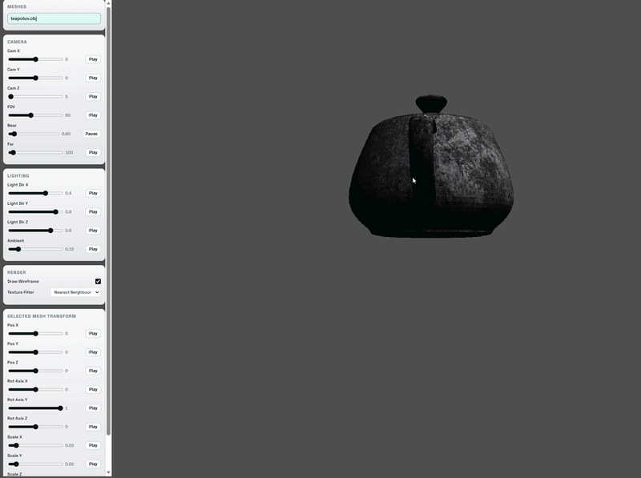

# HTML Canvas Software Rasteriser 

A simple software rasterizer experiment in TypeScript ,HTML Canvas 

## Showcase

Features : 

1. Line Rendering using Bresenham algorithm , and Triangle rasterisation using Barycentric interpolation 

-

2. Texture Sampling , Filtering ( Nearest Neighbour and Bi linear filtering )

-

3. Obj Loading 
-

4. Near and far plane Clipping 

-

5. Alpha Blending 

-

6. Stencil Buffer for masking parts of framebuffer 

7. Z buffering 

8. Back Face Culling 

9. Custom Math Utilities 

